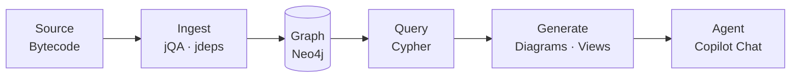
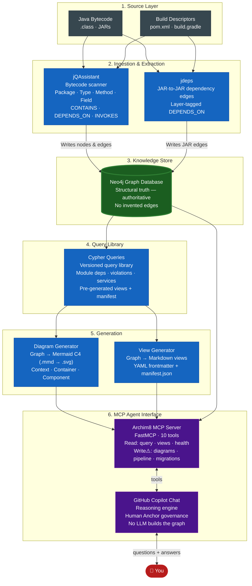
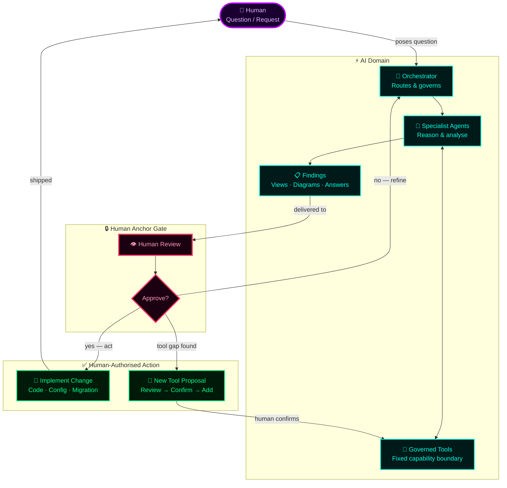

<div align="center">

# 🔱 Archim8

### **Architecture Extraction & Documentation Engine for Java Systems**


**Author:** Stephen Buckley

_Licensed under the [MIT License](LICENSE)_

</div>

---

## 📖 What is it?

Archim8 points at a Java codebase, scans it into a graph database, and lets you ask questions about its architecture in plain English.

It builds authoritative structure from static analysis — JAR dependencies, class hierarchies, call graphs, module layers — and exposes that through an AI agent that writes and runs graph queries on your behalf. Every answer is backed by real graph data, not inference.

The AI layer is a **VS Code Copilot Chat MCP agent**: Archim8 runs as an MCP (Model Context Protocol) server, exposing its tools — graph queries, view reading, diagram generation, Docker health, pipeline execution — directly to GitHub Copilot in your IDE. There is no separate LLM session to manage. Copilot reasons over your codebase graph using Archim8 tools, and a governance model called the **Human Anchor** ensures every write operation pauses for explicit human approval before executing.

> Archim8 does **not** read or edit your source code. It reads compiled bytecode and build metadata only.
> LLMs are used for reasoning and routing — never for inferring structural relationships. Those come from the bytecode.

**What it produces:**

- Architecture documentation and component summaries
- Dependency and coupling analysis
- Architecture diagrams (Mermaid C4 — context, container, component) rendered to SVG
- A queryable structural graph (Neo4j) you can explore directly
- Answers to plain-English architecture questions backed by graph evidence

---

## Table of Contents

1. [What is it?](#-what-is-it)
2. [Requirements](#-requirements)
3. [Quick Start](#-quick-start)
4. [How It Works](#️-how-it-works)
5. [System Architecture Diagram](#️-system-architecture-diagram)
6. [Agentic Architecture](#-agentic-architecture)
   - [Why graph queries over RAG](#why-graph-queries-over-rag)
   - [MCP tools](#mcp-tools)
   - [Specialist prompts](#specialist-prompts)
   - [Technology stack](#technology-stack)
   - [Key Agentic Principles — The Human Anchor](#key-agentic-principles--the-human-anchor)
7. [Graph Model](#️-graph-model)
8. [Project Structure](#-project-structure)
9. [Future Editions](#-future-editions)

---

## 🔧 Requirements

Archim8 runs on any machine with Docker and Python 3.11+. The pipeline layers (ingest through generate) need no LLM. The agent interface uses **GitHub Copilot Chat** via the MCP server — no separate API keys required.

> Run `make doctor` to check your environment automatically.

<details id="tool-requirements">
<summary><strong>Tool requirements (click to expand)</strong></summary>

| Tool | Minimum | Purpose | Required? |
|------|---------|---------|-----------|
| Docker Desktop / Engine | Latest stable | Neo4j + jQAssistant containers | Yes |
| JDK (Temurin / OpenJDK) | 17 (recommend 17 or 21) | jQAssistant, jdeps, target builds | Yes |
| Maven or Gradle | Project-compatible | Build target repo artifacts | Yes |
| Neo4j (via Docker) | 5.x | Structural truth graph store | Yes |
| jQAssistant (via Docker) | Latest stable | Bytecode scanner | Yes |
| PlantUML (CLI or Docker) | Latest stable | C4 diagram rendering | Yes |
| Git | 2.x | Version control | Yes |
| Python | 3.11+ | Agent, pipeline scripts, transforms | Yes |
| PowerShell | 7+ (`pwsh`) | Archim8 shell scripts | Yes (Windows) |
| Make | 4.x | Convenience targets | Optional |

</details>

<details>
<summary><strong>System requirements (click to expand)</strong></summary>

| Resource | Minimum | Recommended | Notes |
|----------|---------|-------------|-------|
| **RAM** | 8 GB | 16+ GB | Neo4j + large codebases require additional heap space |
| **CPU** | 4 cores | 8+ cores | Parallel scanning benefits from more cores |
| **Disk** | 10+ GB free | 50+ GB free | Graph storage grows with project size |
| **OS** | macOS, Linux, Windows | macOS or Linux | WSL2 recommended on Windows |

</details>

<details>
<summary><strong>LLM / agent interface (click to expand)</strong></summary>

The ingest → store → query → generate pipeline layers run without an LLM. An LLM is only required to use the interactive agent interface.

Archim8 uses **GitHub Copilot Chat** (VS Code) as the LLM interface via the MCP server. No separate API keys or environment variables needed — your existing Copilot subscription is the credential. Ensure the MCP server is running and registered in `.vscode/mcp.json` (done automatically on workspace open).

</details>

<details>
<summary><strong>Recommended VS Code extensions (click to expand)</strong></summary>

| Extension | ID | Purpose |
|-----------|----|---------|
| PowerShell | `ms-vscode.powershell` | Script editing and debugging |
| Python | `ms-python.python` | Python IntelliSense and debugging |
| Pylance | `ms-python.pylance` | Python type checking |
| Docker | `ms-azuretools.vscode-docker` | Container management |
| Neo4j | `neo4j-extensions.vscode-neo4j` | Cypher syntax highlighting + browser |
| YAML | `redhat.vscode-yaml` | Config file validation |
| Makefile Tools | `ms-vscode.makefile-tools` | Makefile support |
| PlantUML | `jebbs.plantuml` | Diagram preview |
| Markdown All in One | `yzhang.markdown-all-in-one` | Markdown editing |
| Mermaid Preview | `bierner.markdown-mermaid` | Mermaid diagrams in markdown |
| Java Extension Pack | `vscjava.vscode-java-pack` | Java support for target project inspection |
| GitLens | `eamodio.gitlens` | Git history and blame |
| Rainbow CSV | `mechatroner.rainbow-csv` | Inspect import/export CSV files |
| EditorConfig | `editorconfig.editorconfig` | Consistent formatting |

</details>

<details id="verification">
<summary><strong>Verification (click to expand)</strong></summary>

After installation, verify your environment with:

```bash
docker --version
docker compose version
java -version
jdeps --version
python --version
pwsh --version
git --version
make --version   # optional
```

Or run `make doctor` for a full automated environment check.

</details>

<details>
<summary><strong>Dependencies — open source only (click to expand)</strong></summary>

| Purpose | Tool | License |
|---------|------|---------|
| **Baseline Scanning** | **jQAssistant** | Apache 2.0 |
| Graph Store | Neo4j Community | GPLv3 |
| AST Parsing (optional) | JavaParser or Spoon | Apache 2.0 / MIT |
| Dependency Analysis (optional) | jdeps (JDK built-in) | GNU GPL + Classpath Exception |
| Call Graph (optional) | Soot or WALA | LGPL / Eclipse Public License |
| Graph Query | Cypher (Neo4j) | N/A |
| Diagram Generation | PlantUML | GPL with exceptions |
| C4 Modeling | C4-PlantUML | MIT |
| MCP Server | FastMCP | MIT |

All tools listed are open source. jQAssistant is the only **required** external tool for baseline graph population.

</details>

---

## 🚀 Quick Start

### For developers

> **Prerequisites:** Docker, Python 3.11+, VS Code with GitHub Copilot extension. Run `make doctor` to verify.

```powershell
# 1 - Clone and enter the project
git clone <repo-url>
cd archim8

# 2 - Start Neo4j
make docker-up

# 3 - Configure credentials
#     Copy the template and set NEO4J_PASSWORD in archim8.local.env
Copy-Item 00_orchestrate/config/archim8.local.env.template `
          00_orchestrate/config/archim8.local.env

# 4 - Point Archim8 at your Java repo
#     Set ARCHIM8_TARGET_REPO in archim8.local.env

# 5 - Run the ingest pipeline
make full-pipeline   # scans your repo into Neo4j (jdeps + jQAssistant)
make generate-all    # generate views and diagrams from the graph
```

That's it. Copilot queries Neo4j through the Archim8 MCP tools and returns structured answers backed by real graph data.

<details>
<summary><strong>Run stages individually (click to expand)</strong></summary>

```powershell
make doctor             # verify environment
make status             # check what is running
make jqa-install        # one-time: build the jQAssistant Docker image
make jqa-scan           # scan target repo
make jqa-analyze        # run analysis rules
make generate-views     # generate Markdown architecture views
make generate-diagrams  # generate Mermaid C4 diagrams
```

</details>

### Activating the agent

1. Open VS Code and open the Copilot Chat panel
2. Switch to **Agent mode** (the mode selector appears in the Chat input bar)
3. Attach the prompt file: `.github/prompts/archim8_agent.prompt.md`
   — or — type `@archim8_agent` if you have the prompt file set as your active agent
4. Verify the tools are loaded: ask `"Run Step 0 — check the Archim8 stack health"` to confirm Docker, Neo4j, and the MCP connection are all live
5. Ask your architecture question

No GitHub tokens or OpenAI API keys required — GitHub Copilot Chat is the agent interface.

### Example prompts

```
"Create the high-level architecture of my target application — C1 context through C3 component views"

"Give me a view of the key architecture patterns for concurrent operations — which actors are involved
 and how do they coordinate?"

"Show me a C2–C3 view of the observability stack and identify which logging frameworks are in use"

"What are the main modules and how do they depend on each other?"

"Show me all architectural boundary violations and explain what each one means"

"Generate a component view of the messaging layer"

"Which modules have the highest incoming dependency count — show me the top 10"

"Draft §2 of the architecture document covering the actor model for concurrent operations"
```

<details>
<summary><strong>MCP server configuration (click to expand)</strong></summary>

The server is pre-registered in `.vscode/mcp.json`. Environment variables read from `00_orchestrate/config/archim8.local.env`:

| Variable | Purpose | Default |
|----------|---------|---------|
| `ARCHIM8_TARGET_REPO` | Path to your Java repository | — |
| `NEO4J_URI` | Neo4j Bolt connection string | `bolt://localhost:7687` |
| `NEO4J_USER` | Neo4j username | `neo4j` |
| `NEO4J_PASSWORD` | Neo4j password | — |

</details>

### For non-technical users

Archim8 answers questions about Java application architecture. It reads bytecode facts from a graph database — it does not read or modify source code.

Open VS Code → Copilot Chat panel → Agent mode → attach `.github/prompts/archim8_agent.prompt.md`. Type your question and press Enter.

<details>
<summary><strong>What you can ask (click to expand)</strong></summary>

| Category | Example questions |
|----------|------------------|
| **Modules** | "What modules does this application have?" · "Which module has the most classes?" |
| **Dependencies** | "What does the persistence module depend on?" · "Which components are most depended upon?" |
| **Architecture** | "Show me the layer structure" · "Are there any forbidden dependencies?" |
| **Diagrams** | "Generate a C2 container diagram" · "Give me a C3 component view of the concurrency layer" |
| **Violations** | "Are there any layering violations?" · "Which packages break module boundaries?" |

Archim8 cannot modify source code, answer questions about business logic, or analyse repos that have not been ingested. Run `make full-pipeline` first.

</details>

---

## ⚙️ How It Works



Archim8 is composed of seven pipeline layers, each with a dedicated folder. Each layer produces durable artifacts that feed the next.

| # | Layer | Folder | Responsibility | Key Tools |
|---|-------|--------|----------------|-----------|
| 1 | **Source** | _(external target repo)_ | Java bytecode, build descriptors — the input | Maven / Gradle |
| 2 | **Ingestion & Extraction** | [`01_ingest/`](01_ingest/) | Scan bytecode and build metadata into the graph; jdeps enrichment | **jQAssistant** · jdeps |
| 3 | **Knowledge Store** | [`02_store/`](02_store/) | Run and configure Neo4j; authoritative graph persisted here — no invented edges | Neo4j 5.x (Docker) |
| 4 | **Query Library** | [`03_query/`](03_query/) | Versioned Cypher query library; answer architecture questions against the graph | Cypher |
| 5 | **Generation** | [`04_generate/`](04_generate/) | Convert query results into Mermaid C4 diagrams and structured Markdown views; maintain manifest index | Python · Jinja2 |
| 6 | **Delivery** | [`05_deliver/`](05_deliver/) | Structured output sink for generated views and diagrams | — |
| 7 | **Agentic Interface** | [`06_agents/`](06_agents/) | MCP server exposing Archim8 tools to GitHub Copilot Chat; specialist prompts; Human Anchor governance | FastMCP · VS Code Copilot Chat |

**Orchestration** — [`00_orchestrate/`](00_orchestrate/) holds the run scripts and config profiles that compose layers into end-to-end and partial flows. It contains no tool-specific logic.

<details>
<summary><strong>Key components (click to expand)</strong></summary>

#### jQAssistant Scanner
Baseline graph ingestion engine — scans Java bytecode and Maven POMs into Neo4j.
Populates `:Maven:Module`, `:Java:Package`, `:Java:Type`, `:Java:Method` nodes and `CONTAINS`, `DEPENDS_ON`, `IMPLEMENTS`, `EXTENDS` relationships tagged `layer:'jqa'`.
Containerized as `archim8-jqa` — build once with `make jqa-install`.
See [01_ingest/jqassistant/](01_ingest/jqassistant/).

#### jdeps Extractor
Extracts jar-to-jar dependency edges from Maven builds without modifying the target app.
Outputs `jdeps-jar-edges.csv` loaded into Neo4j via Cypher.
See [01_ingest/jdep/scripts/](01_ingest/jdep/scripts/).

#### Neo4j Graph Store
Graph database holding structural truth — the authoritative source for all code relationships.
Browser UI at http://localhost:7474, Bolt at bolt://localhost:7687.
See [02_store/neo4j/](02_store/neo4j/).

#### Cypher Query Library
Read-only Cypher queries answering architecture questions — module deps, entrypoints, call paths, quality checks.
Drop `.cypher` files into the relevant sub-folder to extend; no code changes needed.
See [03_query/cypher/library/](03_query/cypher/library/).

#### Generator Layer
Transforms query results into Mermaid C4 diagrams and Markdown views.
Jinja2 templates fully customisable.
See [04_generate/generators/](04_generate/generators/).

</details>

---

## 🏗️ System Architecture Diagram



**Layer Legend**:

| # | Layer | Colour | Components |
|---|-------|--------|------------|
| 1 | Source | Dark grey | Java bytecode, build descriptors |
| 2 | Ingestion & Extraction | Blue | jQAssistant (bytecode), jdeps (JAR edges) |
| 3 | Knowledge Store | Green (bold) | Neo4j graph — authoritative, bytecode-derived |
| 4 | Query Library | Blue | Versioned Cypher queries; pre-generated views and manifest |
| 5 | Generation | Blue | Mermaid C4 diagram generator, Markdown view generator |
| 6 | MCP Agent Interface | Purple / Red | Archim8 MCP server · GitHub Copilot Chat |

**Data flow**: Every node and edge in the graph is derived from bytecode. The LLM queries the graph — it never writes to it.

---

## 🤖 Agentic Architecture

Archim8 exposes its pipeline capabilities as an **MCP (Model Context Protocol) server** — `06_agents/mcp_server.py`, built on FastMCP. GitHub Copilot Chat in VS Code connects to this server and uses the registered tools to answer architecture questions, generate diagrams, and run pipeline operations.

There is no separate orchestrator process or LangGraph graph. Copilot is the reasoning engine. Archim8 provides the tools and the governance contract.

A dedicated agent prompt (`.github/prompts/archim8_agent.prompt.md`) loads the grounding contract, tool descriptions, Human Anchor rules, and specialist context into every Copilot Chat session.

### Why graph queries over RAG

Archim8 was originally designed as a RAG (Retrieval-Augmented Generation) pipeline: chunk source documents, embed them into a vector store, and let an LLM retrieve relevant chunks to answer architecture questions. That design was superseded before it was implemented.

The reason is the graph itself. Static analysis with jQAssistant and jdeps does not produce a *description* of the architecture — it produces *the architecture*, encoded as verified bytecode-level evidence. A class either depends on another class or it does not. A module either contains a type or it does not. These are not estimates that benefit from fuzzy retrieval; they are facts that benefit from exact queries.

| | RAG over documents | Graph queries (Archim8) |
|---|---|---|
| **Source of truth** | Chunked text — lossy, stale | Bytecode-derived graph — exact, reproducible |
| **Query mechanism** | Embedding similarity (approximate) | Cypher (deterministic) |
| **Hallucination risk** | High — LLM fills gaps between chunks | None for graph facts — LLM only narrates |
| **Staleness** | Requires re-embedding on code change | Re-run `make full-pipeline` |
| **Trace to evidence** | Difficult — which chunk? | Every answer maps to graph rows |

The practical consequence: every architectural claim Archim8 makes is traceable to a specific node or edge in Neo4j. The LLM (Copilot) writes and interprets Cypher queries and narrates the results — it never invents relationships. This is a stronger guarantee than any retrieval threshold can provide.

### MCP tools

| Tool | Module | Description |
|------|--------|-------------|
| `archim8_run_cypher_query` | `tools/graph_query.py` | Read-only Cypher; write keywords blocked by regex |
| `archim8_apply_cypher_migration` | `tools/graph_query.py` | Write Cypher; path-gated to `02_store/neo4j/config/schema/` |
| `archim8_list_available_views` | `tools/view_reader.py` | Lists manifest entries |
| `archim8_read_architecture_view` | `tools/view_reader.py` | Reads view Markdown |
| `archim8_generate_architecture_diagram` | `tools/diagram_gen.py` | Triggers PlantUML generator |
| `archim8_generate_mermaid_diagram` | `tools/mermaid_gen.py` | Writes `.mmd` to `05_deliver/output/diagrams/` |
| `archim8_run_make_target` | `tools/shell_exec.py` | Runs allowlisted Make targets only |
| `archim8_check_file_exists` | `tools/shell_exec.py` | Checks file / dir exists within workspace |
| `archim8_read_log_file` | `tools/shell_exec.py` | Reads last N lines of named log (allowlisted dirs) |
| `archim8_check_docker_health` | `tools/docker_health.py` | Inspects named containers (allowlisted set) |

### Specialist prompts

Specialist context files in `06_agents/prompts/` scope each domain:

| Prompt | Domain |
|--------|--------|
| `orchestrator.md` | Top-level routing contract and tool-use rules |
| `infra.md` | Docker health, pipeline ops, pre-flight checks |
| `ingest.md` | jQAssistant / jdeps scan management |
| `store.md` | Neo4j schema, migrations, data quality |
| `query.md` | Cypher analysis, cross-layer reasoning |
| `generate.md` | Diagram + view generation, staleness checks |
| `deliver.md` | Stakeholder narrative, view synthesis |
| `documentor.md` | Architecture document authoring; Pattern A/B section templates; C4 heading convention |

### Technology stack

| Concern | Technology |
|---------|-----------|
| Agent interface | GitHub Copilot Chat (VS Code) + MCP |
| MCP server | FastMCP (`06_agents/mcp_server.py`) |
| Graph store | Neo4j 5.x (Docker) |
| Bytecode scanner | jQAssistant |
| Dependency extraction | jdeps (JDK built-in) |
| Diagram source | Mermaid (`.mmd` → `.svg` via `mmdc`) |
| Diagram layout | PlantUML C4 (legacy, still supported) |
| Query language | Cypher |
| Scripting | Python 3.11+, PowerShell 7+ |
| Build orchestration | Make |

### Key Agentic Principles — The Human Anchor

Archim8 is built on a named principle: **The Human Anchor**.

AI is the engine. Humans hold the anchor chain. Every analysis, every proposed change, every capability extension flows through a human decision point before it has real-world effect. The AI reasons freely and autonomously within governed boundaries — but those boundaries are set, reviewed, and extended exclusively by humans.

This is not a limitation on AI capability. It is the architectural choice that makes Archim8 trustworthy enough to run against a production codebase.



**Agentic at runtime** — the agent decides *which* tools to call, in *what order*, with *what parameters*, based on the question. It reasons, routes, and chains steps autonomously. Archim8 implements this fully.

**Agentic at build time** — the agent writes and deploys its own tools without human involvement. Archim8 does not do this. The right framing: **agents are autonomous in reasoning and routing. Tools are fixed in capability boundary.**

If a capability does not exist as a tool, the agent says so explicitly — it describes what would be needed and stops. A precise *"I cannot do this yet"* is a complete and correct answer.

<details>
<summary><strong>Extending Archim8 (click to expand)</strong></summary>

#### Add a Cypher query

1. Create a `.cypher` file in `03_query/cypher/library/<concern>/`
2. Write a parameterised Cypher query — use `RETURN` to produce a result set
3. Run `make generate-views` — the manifest index is updated automatically
4. The agent's `list_views` and `read_architecture_view` tools discover it on the next run

#### Add a specialist prompt

1. Create `06_agents/prompts/<name>.md` with the specialist's domain context, tool-use rules, and output format
2. Reference it in `.github/prompts/archim8_agent.prompt.md` or chain it as a sub-prompt

#### Add a tool

1. Write a plain Python function in `06_agents/tools/<name>.py` — no LangChain decorators
2. Register it with the FastMCP server in `06_agents/mcp_server.py` using `@mcp.tool()`
3. Update `06_agents/tools/__init__.py`
4. Document the tool in the relevant specialist prompt

</details>

---

## 🗺️ Graph Model

The graph is populated by two ingest tools. All relationships are traced to real bytecode or build metadata — nothing is inferred.

**jdeps** (`source='jdeps'`):

| Element | Type | Notes |
|---------|------|-------|
| `:Jar {name, group, type, source, id}` | Node | One node per JAR artefact |
| Layer label | Label | Target-specific label applied to each JAR node (e.g. `Common`, `Platform`, `Runtime`). Configured per project in the jdeps extraction step. |
| `(:Jar)-[:DEPENDS_ON {layer:'jdeps'}]->(:Jar)` | Relationship | Compile/runtime JAR dependency |

**jQAssistant** (`layer='jqa'`):

| Element | Type | Notes |
|---------|------|-------|
| `:Maven:Module` | Node | Repository module |
| `:Java:Package {fqn}` | Node | Java package |
| `:Java:Type {fqn, name, visibility}` | Node | Java type (class, interface, enum) |
| `:Java:Method {name, signature, visibility}` | Node | Method |
| `(:Type)-[:DEPENDS_ON {layer:'jqa'}]->(:Type)` | Relationship | Type-level dependency |
| `(:Type)-[:INVOKES]->(:Method)` | Relationship | Call graph edge |
| `(:Type)-[:EXTENDS\|IMPLEMENTS]->(:Type)` | Relationship | Inheritance / implementation |
| `(:Package)-[:CONTAINS]->(:Type)` | Relationship | Package membership |

> The graph is the source of truth. LLMs explain what the graph contains — they never add relationships to it.

---

## 📁 Project Structure

```
archim8/
├── 📄 README.md                           # This file
├── 📄 LICENSE
├── 📄 Makefile                            # Convenience targets
│
├── 🎛️  00_orchestrate/                    # Run flows end-to-end or in part
│   ├── config/                            # Run profiles and pipeline configs
│   │   ├── archim8.env                   # Default config (tracked)
│   │   ├── archim8.local.env             # Machine-specific overrides (gitignored)
│   │   ├── default.yaml
│   │   ├── ingest_full.yaml               # Pipeline definition: full ingest
│   │   ├── generate_docs.yaml             # Pipeline definition: doc generation
│   │   └── profiles/                      # local / ci / neo4j profiles
│   ├── scripts/                           # Wrapper scripts — no tool-specific logic
│   │   ├── load-env.ps1                   # Loads .env into shell
│   │   └── run-jdeps-pipeline.ps1         # Orchestrates full jdeps flow
│   └── README.md
│
├── 🔬 01_ingest/                          # Extract facts → load into graph
│   ├── jqassistant/                       # Baseline bytecode scanner
│   │   ├── config/                        # jqassistant.yml and scan settings
│   │   ├── scripts/                       # scan.sh · scan-docker.sh
│   │   ├── rules/baseline/                # Cypher-based analysis rules
│   │   ├── plugins/                       # Custom jQAssistant plugins
│   │   └── README.md
│   └── jdep/                              # jdeps jar-to-jar edge extractor
│       ├── config/
│       └── scripts/                       # jdeps-run.ps1 · jdeps-extract-edges.ps1
│
├── 🗄️  02_store/                          # Graph persistence — Neo4j lifecycle
│   └── neo4j/
│       ├── docker/                        # docker-compose.yml · .env.template · .env
│       │   ├── import/                    # CSV files loaded into Neo4j
│       │   └── export/                    # Data exported from Neo4j
│       ├── config/
│       │   ├── init/                      # 01-constraints · 02-index · 03-bootstrap
│       │   └── schema/                    # constraints · indexes · bootstrap · migrations/
│       ├── scripts/                       # Store lifecycle helpers
│       └── README.md
│
├── 🔎 03_query/                           # Semantic access — Cypher query library
│   └── cypher/
│       ├── library/                       # Versioned query files by concern
│       │   ├── modules/                   # Package and module dependencies
│       │   ├── entrypoints/               # Main methods, controllers
│       │   ├── callpaths/                 # Bounded call chains
│       │   ├── runtime_primitives/        # IO / date / numeric ops
│       │   ├── quality/                   # Graph integrity checks
│       │   └── jdeps/                     # jdeps-specific queries
│       ├── config/                        # Query params and runner config
│       └── scripts/                       # Query execution helpers
│
├── 🎨 04_generate/                        # Produce artifacts from query results
│   ├── generators/                        # Diagram and doc generators
│   │   ├── templates/                     # Jinja2 templates (PlantUML C4, Markdown)
│   │   ├── scripts/                       # Renderer scripts (graph → artifact)
│   │   └── config/
│   └── agents/                            # Agent config and pipeline scripts
│       ├── config/                        # Agent prompts and guardrails
│       └── scripts/                       # Pipeline orchestration scripts
│
├── 📤 05_deliver/                         # Package and publish outputs
│   ├── input/                             # Staged outputs from pipeline layers
│   └── output/                            # Generated artifact sink (gitignored)
│
├── 🤖 06_agents/                          # MCP server — Archim8 agent interface
│   ├── mcp_server.py                      # FastMCP server; all tools registered
│   ├── tools/                             # Plain Python tool functions (no LangChain)
│   │   ├── graph_query.py
│   │   ├── view_reader.py
│   │   ├── diagram_gen.py
│   │   ├── mermaid_gen.py
│   │   ├── shell_exec.py
│   │   └── docker_health.py
│   └── prompts/                           # Per-specialist system prompts
│       ├── orchestrator.md
│       ├── infra.md · ingest.md · store.md
│       ├── query.md · generate.md · deliver.md
│       └── documentor.md
│
└── 🧪 14_tests/                           # MCP smoke tests
    └── test_mcp_server.py
```

> **Note — target application**: Archim8 operates on an external Java repository. Point `ARCHIM8_TARGET_REPO` in `00_orchestrate/config/archim8.env` at your project; no files from the target app are stored inside this repo.
>
> **Note — Neo4j data volumes**: By default the Neo4j container mounts data and logs to absolute paths set in `02_store/neo4j/docker/.env`. These paths are developer-local and gitignored.

---

## 🌟 Future Editions

Ideas and directions for future development — listed by priority, not by commitment.

| # | Feature | Priority | Notes |
|---|---------|----------|-------|
| 1 | **CI/CD integration** — Archim8 as a pipeline step: scan on PR, diff the graph, surface architectural regressions as build annotations | High | Enables continuous architecture governance |
| 2 | **Expand beyond Java** — Kotlin and Scala first (JVM-compatible with existing tooling); then C#/.NET, Python, Go with language-specific scanners | Medium | Core pipeline is language-agnostic by design |
| 3 | **Richer violation detection** — cyclic dependency analysis, module boundary enforcement with configurable severity and suppression | Medium | Builds on existing layering rules |
| 4 | **Live continuous analysis** — watch mode that re-scans on bytecode change and updates the graph incrementally | Medium | Requires incremental ingest design |
| 5 | **The Tool Forge (controlled extension)** — agent-proposed tool generation with explicit human review and approval gate | Low | Deliberate future extension — not until core tool set is stable |
| 6 | **Shareable architecture snapshots** — export graph state as a portable bundle; import and diff against a later snapshot | Low | Useful for audits and architecture reviews |
| 7 | **Additional documentation formats** — Structurizr DSL, Confluence/ADO wiki output, exportable HTML views | Low | Nice to have once core pipeline is stable |

---

<div align="center">

### 🛠️ Built With


---

**© 2026 Stephen Buckley | Open Source Project**

</div>